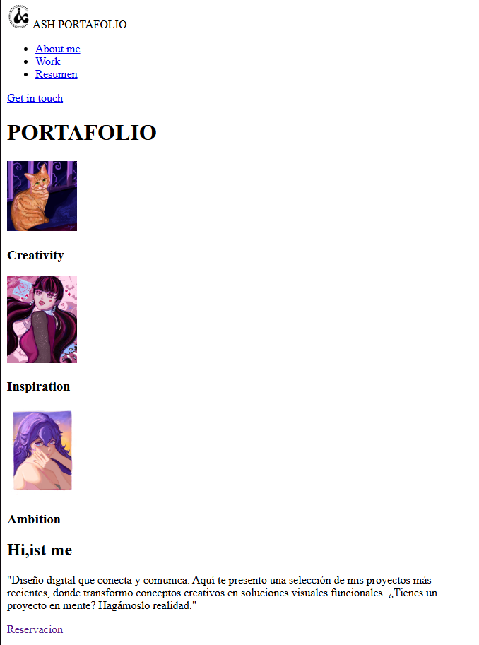
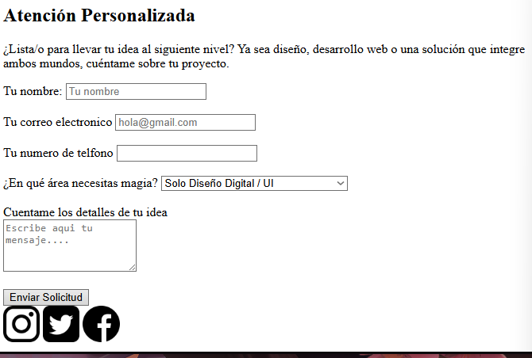

🦄 Portafolio Web - Proyecto Final
Este repositorio contiene el código fuente una prueba de uan pagina pensada para usarla como mi portafolio personal, creado como proyecto final para demostrar la correcta estructuración de una página web desde cero. 

🚀 Demo en Vivo
Puedes visitar la página final publicada a través de GitHub Pages aquí:
👉 [PENDIENTE: Reemplazar con el enlace de GitHub Pages]

🛠️ Tecnologías Utilizadas
HTML5 Semántico: Uso de etiquetas estructurales como <header>, <main>, <section>, <article>, <nav> y <footer>.

Git y GitHub: Para el control de versiones y el alojamiento del proyecto.

